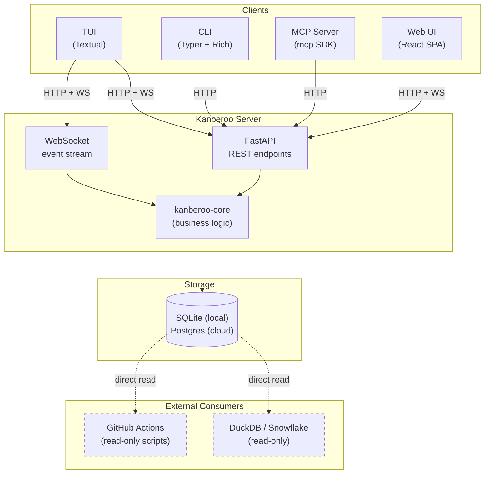

# Kanberoo

A kanban-style issue tracker with a TUI, REST + WebSocket API, CLI, and MCP server. Designed to be useful standalone, and to integrate with [trusty-cage](https://pypi.org/project/trusty-cage/) for AI-driven workflows.

**Status:** Phase 2 complete. Single-user, terminal + web + AI.

## What it does

Kanberoo exposes the same data through five surfaces:

- **TUI** (Textual) for terminal-centric humans: workspace list, kanban board, story detail, fuzzy search, audit feed.
- **Web UI** (React SPA, served by the API at `/ui`): workspace list, kanban board with drag-to-transition, story detail, comments, tags, live WebSocket updates, keyboard shortcuts.
- **CLI** (Typer + Rich): scriptable access to every resource, JSON output for pipelines.
- **REST + WebSocket API** (FastAPI): the source of truth. WebSocket feeds live change events; REST is always authoritative.
- **MCP server**: lets AI agents (outer Claude in particular) read and write the board through the Model Context Protocol.

The data model is intentionally Jira-shaped but simpler. Workspaces contain optional Epics which contain Stories. Stories carry comments, tags, typed linkages, priority, and a standard kanban lifecycle. Every mutation is attributed to a `human`, `claude`, or `system` actor and recorded in an immutable audit log.

## Architecture



## Installation

Requires Python 3.12 or newer.

```bash
# Everything (server + TUI + CLI + MCP)
pip install 'kanberoo[all]'

# Or pick and choose:
pip install kanberoo-api          # Just the server (no web UI)
pip install 'kanberoo-api[web]'   # Server + bundled web UI at /ui
pip install kanberoo-cli          # CLI only (pulls in core)
pip install kanberoo-tui          # TUI only
pip install kanberoo-mcp          # MCP server only
```

Contributors working from a checkout should use the [uv](https://docs.astral.sh/uv/) workspace instead:

```bash
uv sync --all-packages --dev
```

## Quickstart

For a human walking up cold, all the way from install to a running board:

```bash
# 1. Install
pip install 'kanberoo[all]'

# 2. Initialise config dir, apply migrations, mint your first token
kb init

# 3. Start the server (docker compose under the hood)
kb server start

# 4. Create your first workspace
kb workspace create --key KAN --name "My Work"

# 5. File a story
kb story create --workspace KAN --title "First task"

# 6. In another terminal, open the TUI on the board
kanberoo-tui
```

Press `?` on any TUI screen for the keybinding cheatsheet. Press `/` from the workspace list or board for fuzzy search. `a` opens the global audit feed.

## Configuration

Kanberoo reads settings from `$KANBEROO_CONFIG_DIR/config.toml` (default `~/.kanberoo/config.toml`), which `kb init` creates for you. Environment variables override the TOML values when set.

| Variable | Consumed by | Default / note |
|----------|-------------|----------------|
| `KANBEROO_DATABASE_URL` | core, api, `kb init`, `kb backup` | Required for the API to start. Docker supplies `sqlite:////data/kanberoo.db` inside the container. |
| `KANBEROO_API_URL` | cli, tui, mcp | Overrides `api_url` in `config.toml`. Example: `http://localhost:8080`. |
| `KANBEROO_TOKEN` | cli, tui | Bearer token for API auth. Overrides `token` in `config.toml`. |
| `KANBEROO_MCP_TOKEN` | mcp | MCP-specific token; falls back to `KANBEROO_TOKEN`. |
| `KANBEROO_CONFIG_DIR` | cli, tui, mcp, `kb init` | Override for the config directory. Default: `~/.kanberoo`. |
| `KANBEROO_WORKSPACE` | cli | Default workspace key so you can omit `--workspace` on every command. Example: `KAN`. |
| `KANBEROO_API_HOST` | api server | Uvicorn bind host. Default: `0.0.0.0`. |
| `KANBEROO_API_PORT` | api server | Uvicorn bind port. Default: `8080`. |
| `KANBEROO_COMPOSE_FILE` | `kb server` | Path to a non-default `docker-compose.yml` (useful for CI). |
| `KANBEROO_MCP_LOG_LEVEL` | mcp | `INFO` by default; `DEBUG` for verbose MCP logs. |

## Web UI

The `kanberoo-web` package ships a Vite + React SPA that `kanberoo-api` serves at `/ui`. Once the API is running, visit `http://localhost:8080/ui` in a browser.

### First-boot inside the container

`kb server start` runs `docker compose up -d`; the API runs inside the `kanberoo-api` container with its SQLite DB on a named volume. The volume is blank on first boot, so migrations and the initial token have to happen inside the container:

```bash
# Bring the stack up
kb server start

# Apply migrations
docker compose exec -e KANBEROO_DATABASE_URL="sqlite:////data/kanberoo.db" \
  kanberoo-api \
  uv run --no-dev alembic -c /app/packages/kanberoo-core/alembic.ini upgrade head

# Mint the first token (print it once; save it)
docker compose exec -e KANBEROO_DATABASE_URL="sqlite:////data/kanberoo.db" \
  kanberoo-api \
  uv run --no-dev kb init
```

Copy the `kbr_` token that `kb init` prints and paste it into the `/ui` login form. The token is stored in browser `localStorage` under `kanberoo.token`; press "Log out" to clear it.

You can also mint additional tokens later with `kb token create --actor-type human --actor-id you --name "web"` (inside the container, same `docker compose exec` wrapper).

Shipped in v0.2.0:

- Workspace list with inline create.
- Kanban board with drag-to-transition, illegal-move rejection, optimistic updates.
- Story detail: markdown description, metadata, comments (with one-level replies), tags, audit trail.
- Live updates via the existing `/api/v1/events` WebSocket.
- Story creation modal (`n` on the board).
- In-board search (`/` on the board; matches on human id prefix and title substring).
- Keyboard shortcuts: `n` new story, `/` search, `e` edit story, `?` shortcut help, `Escape` close modal / clear search / exit edit mode.

The release wheel auto-includes the built bundle, so `pipx install --include-deps 'kanberoo[all]'` picks up the UI. Node 20+ is only required at build time for maintainers publishing a new release.

### Developing the web UI

```bash
make web-build   # Build the SPA into packages/kanberoo-web/src/kanberoo_web/dist/
make web-dev     # Vite dev server on :5173, proxies /api and /api/v1/events to :8080
make web-test    # vitest, single-shot
```

## MCP setup

Let an AI agent drive Kanberoo through the Model Context Protocol. The MCP server is a thin translator between the MCP tool protocol and the Kanberoo REST API; every mutation routes through the API and is attributed to the MCP token's actor.

First create a dedicated `claude`-typed token so AI mutations are audited correctly:

```bash
kb token create --actor-type claude --actor-id outer-claude --name "claude"
```

Copy the plaintext that `kb token create` prints into `KANBEROO_MCP_TOKEN` in your shell, then add this to Claude's `mcpServers` block:

```json
{
  "mcpServers": {
    "kanberoo": {
      "command": "kanberoo-mcp",
      "args": ["--api-url", "http://localhost:8080", "--token-env", "KANBEROO_MCP_TOKEN"]
    }
  }
}
```

See [`docs/mcp-setup.md`](docs/mcp-setup.md) for the full walkthrough, the smoke test, and the tool reference.

## Docs

- [`docs/spec.md`](docs/spec.md): authoritative design intent. Start here if you want the why.
- [`docs/api-reference.md`](docs/api-reference.md): generated REST API reference.
- [`docs/mcp-setup.md`](docs/mcp-setup.md): MCP setup guide for AI agents.
- [`docs/future-skill-draft.md`](docs/future-skill-draft.md): draft workflow skill for AI agents using Kanberoo via MCP.
- [`CLAUDE.md`](CLAUDE.md): guidance for Claude Code when working in this repo.
- [`CHANGELOG.md`](CHANGELOG.md): release notes.

## Development

This is a uv workspace monorepo with six packages in `packages/` (`kanberoo-core`, `-api`, `-cli`, `-tui`, `-mcp`, `-web`) and a top-level meta-package with an `[all]` extra. Before committing anything:

```bash
uv run ruff format .
uv run ruff check --fix .
uv run mypy packages/
uv run pytest
```

## License

MIT. See [`LICENSE`](./LICENSE).
