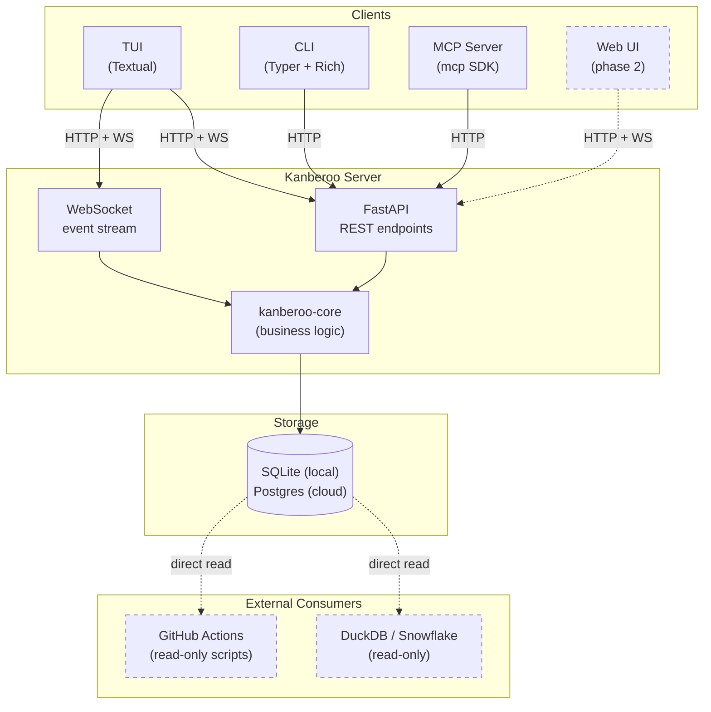

# Kanberoo

A kanban-style issue tracker with a TUI, REST + WebSocket API, CLI, and MCP server. Designed to be useful standalone, and to integrate with [trusty-cage](https://pypi.org/project/trusty-cage/) for AI-driven workflows.

**Status:** Phase 1 complete. Single-user, terminal + AI, no web UI yet.

## What it does

Kanberoo exposes the same data through four surfaces:

- **TUI** (Textual) for terminal-centric humans: workspace list, kanban board, story detail, fuzzy search, audit feed.
- **CLI** (Typer + Rich): scriptable access to every resource, JSON output for pipelines.
- **REST + WebSocket API** (FastAPI): the source of truth. WebSocket feeds live change events; REST is always authoritative.
- **MCP server**: lets AI agents (outer Claude in particular) read and write the board through the Model Context Protocol.

The data model is intentionally Jira-shaped but simpler. Workspaces contain optional Epics which contain Stories. Stories carry comments, tags, typed linkages, priority, and a standard kanban lifecycle. Every mutation is attributed to a `human`, `claude`, or `system` actor and recorded in an immutable audit log.

## Architecture



## Installation

Requires Python 3.12 or newer.

```bash
# Everything (server + TUI + CLI + MCP)
pip install 'kanberoo[all]'

# Or pick and choose:
pip install kanberoo-api     # Just the server
pip install kanberoo-cli     # CLI only (pulls in core)
pip install kanberoo-tui     # TUI only
pip install kanberoo-mcp     # MCP server only
```

Contributors working from a checkout should use the [uv](https://docs.astral.sh/uv/) workspace instead:

```bash
uv sync --all-packages --dev
```

## Quickstart

For a human walking up cold, all the way from install to a running board:

```bash
# 1. Install
pip install 'kanberoo[all]'

# 2. Initialise config dir, apply migrations, mint your first token
kb init

# 3. Start the server. Either via docker compose ...
kb server start

#    ... or directly for local dev
uv run kanberoo-api

# 4. Create your first workspace
kb workspace create --key KAN --name "My Work"

# 5. File a story
kb story create --workspace KAN --title "First task"

# 6. In another terminal, open the TUI on the board
uv run kanberoo-tui
```

Press `?` on any TUI screen for the keybinding cheatsheet. Press `/` from the workspace list or board for fuzzy search. `a` opens the global audit feed.

## MCP setup

Let an AI agent drive Kanberoo through the Model Context Protocol. The MCP server is a thin translator between the MCP tool protocol and the Kanberoo REST API; every mutation routes through the API and is attributed to the MCP token's actor.

First create a dedicated `claude`-typed token so AI mutations are audited correctly:

```bash
kb token create --actor-type claude --actor-id outer-claude --name "claude"
```

Copy the plaintext that `kb token create` prints into `KANBEROO_MCP_TOKEN` in your shell, then add this to Claude's `mcpServers` block:

```json
{
  "mcpServers": {
    "kanberoo": {
      "command": "kanberoo-mcp",
      "args": ["--api-url", "http://localhost:8080", "--token-env", "KANBEROO_MCP_TOKEN"]
    }
  }
}
```

See [`docs/mcp-setup.md`](docs/mcp-setup.md) for the full walkthrough, the smoke test, and the tool reference.

## Docs

- [`docs/spec.md`](docs/spec.md): authoritative design intent. Start here if you want the why.
- [`docs/api-reference.md`](docs/api-reference.md): generated REST API reference.
- [`docs/mcp-setup.md`](docs/mcp-setup.md): MCP setup guide for AI agents.
- [`docs/future-skill-draft.md`](docs/future-skill-draft.md): draft workflow skill for AI agents using Kanberoo via MCP.
- [`CLAUDE.md`](CLAUDE.md): guidance for Claude Code when working in this repo.
- [`CHANGELOG.md`](CHANGELOG.md): release notes.

## Development

This is a uv workspace monorepo with five packages in `packages/` and a top-level meta-package with an `[all]` extra. Before committing anything:

```bash
uv run ruff format .
uv run ruff check --fix .
uv run mypy packages/
uv run pytest
```

## License

MIT.
