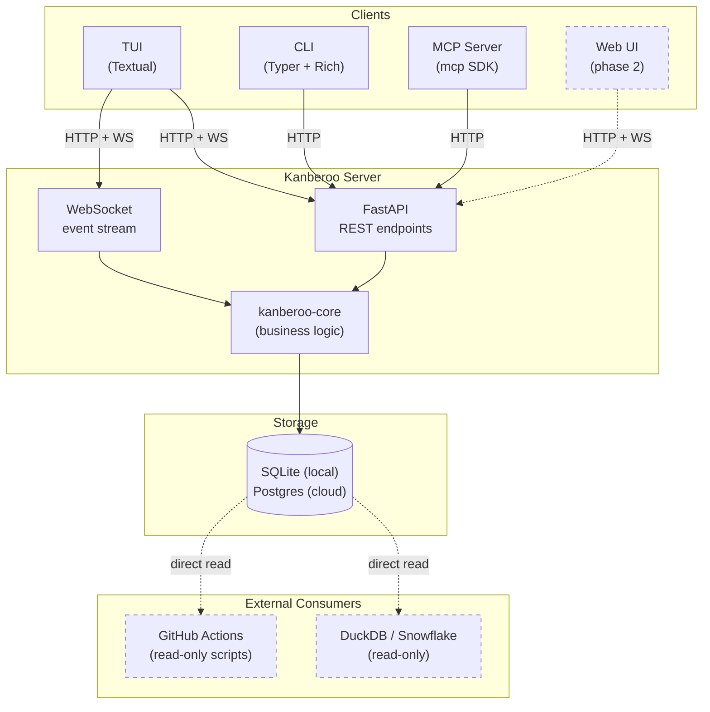

# Kanberoo: Specification

> A kanban-style issue tracker with a TUI, REST + WebSocket API, CLI, and MCP layer. Designed to be useful to humans on its own, and to integrate tightly with trusty-cage for AI-driven workflows.

**Status:** Draft 2. Phase 1 shipped in v0.1.0 (2026-04-19). Phase 2 web UI shipped in v0.2.0 (2026-04-22).

---

## 1. Project Overview

Kanberoo is a self-hosted, single-binary-feeling kanban tool for managing software work. It exposes the same underlying data through four surfaces:

1. A **TUI** for terminal-centric humans (you).
2. A **REST + WebSocket API** as the source of truth for all mutations and live change events.
3. A **CLI** for scripting and quick operations from a shell.
4. An **MCP server** so AI agents (outer Claude in particular) can read and write the board as a tool.

The core data model is intentionally Jira-shaped but dramatically simpler: Workspaces contain optional Epics which contain Stories. Stories carry comments, tags, typed linkages to other stories, priority, and a standard kanban lifecycle.

Kanberoo is designed to be useful **standalone**. A human can drive the entire thing through the TUI or web UI with no AI involvement. The MCP layer is an additive integration surface, not a dependency. The trusty-cage orchestrator uses Kanberoo as a backend for storing work-to-be-done across coding sessions, but Kanberoo has no knowledge of trusty-cage.

### 1.1 Goals

- **Portable data.** Single SQLite file locally, Postgres-ready for eventual cloud deployment. Schema stable and documented so external tools (DuckDB, Snowflake, GitHub Actions, custom scripts) can read it directly.
- **Graceful, well-structured, recoverable.** Soft delete everywhere. Full audit log. Optimistic concurrency with ETags. No destructive operations without a paper trail.
- **AI-native attribution.** Every mutation records whether it came from a human, an AI agent, or a deterministic system process. Surfaces this distinction in the UI.
- **Open source.** MIT or Apache 2.0. Designed for others to self-host.
- **Terminal-first.** The TUI is a first-class citizen, not an afterthought.

### 1.2 Non-Goals (Explicit)

The following are **deliberately out of scope**. If you find yourself implementing one of these without a spec revision, stop:

- Sprints, velocity tracking, burndown charts, agile ceremonies.
- Gantt charts, dependency timelines, critical path analysis.
- Time tracking, billing, effort estimation beyond priority.
- Multi-tenant SaaS. Kanberoo is self-hosted per instance.
- Custom workflows, custom issue types, custom fields. The schema is what it is.
- Real-time collaborative editing of descriptions (Google Docs style). Optimistic concurrency with conflict rejection is sufficient.
- Attachments and file uploads (deferred, not rejected; see phase two).
- Role-based permissions. Single-user in v1; multi-user v2+ will introduce simple owner/collaborator concepts.
- Email notifications, Slack integrations, webhooks out. The WebSocket feed plus external DB reads are the integration surface.
- Web UI in phase one. TUI + API + CLI + MCP only.

---

## 2. Architecture

### 2.1 Component Diagram



### 2.2 Tech Stack

| Layer | Choice | Rationale |
|-------|--------|-----------|
| Language | Python 3.12+ | Familiar to the primary developer, AI-friendly, sufficient for the workload. |
| Web framework | FastAPI | First-class async, Pydantic-native, WebSocket support, strong MCP ecosystem alignment. |
| ORM | SQLAlchemy 2.x | Portable across SQLite and Postgres; Alembic integration; battle-tested patterns that generate reliably from AI tooling. |
| Migrations | Alembic | Canonical choice for SQLAlchemy projects. |
| Schemas | Pydantic v2 | Used by FastAPI natively; shared request/response validation. |
| CLI | Typer + Rich | Matches the trusty-cage aesthetic; low-friction for terminal users. |
| TUI | Textual | Mature, async-friendly, Python-native, supports WebSocket subscriptions cleanly. |
| MCP | `mcp` (official Anthropic SDK) | Canonical; future-compatible with protocol updates. |
| Packaging / deps | uv | Fast, modern, lockfile-first. |
| Deployment (v1) | Docker Compose | Single command to run locally; mirrors eventual cloud shape. |

### 2.3 Repository Structure

Monorepo with separately packaged components sharing a core library:

```
kanberoo/
├── README.md
├── CHANGELOG.md
├── CLAUDE.md                  # Guidance for Claude Code when working on this repo
├── pyproject.toml             # Workspace root (uv workspace)
├── docker-compose.yml
├── Dockerfile
├── packages/
│   ├── kanberoo-core/         # Shared: models, schemas, business logic
│   │   ├── pyproject.toml
│   │   └── src/kanberoo_core/
│   ├── kanberoo-api/          # FastAPI server (REST + WebSocket)
│   │   ├── pyproject.toml
│   │   └── src/kanberoo_api/
│   ├── kanberoo-tui/          # Textual TUI
│   │   ├── pyproject.toml
│   │   └── src/kanberoo_tui/
│   ├── kanberoo-cli/          # Typer CLI
│   │   ├── pyproject.toml
│   │   └── src/kanberoo_cli/
│   └── kanberoo-mcp/          # MCP server
│       ├── pyproject.toml
│       └── src/kanberoo_mcp/
├── migrations/                # Alembic migrations (shared, versioned)
└── tests/                     # Integration tests spanning packages
```

Each package publishes independently to PyPI so users can install just what they need:

```bash
pip install kanberoo-api       # Just the server
pip install kanberoo-tui       # Pulls in kanberoo-core
pip install kanberoo[all]      # Everything
```

### 2.4 Data Portability Contract

This is a first-class design constraint, not an afterthought:

- The database schema is **public** and versioned via Alembic. External tools can read tables directly.
- For SQLite, the `.db` file is portable and mountable. DuckDB reads it via the `sqlite` extension; Snowflake can ingest it as a file.
- For Postgres, a read-only role is part of the standard deploy. External services use that role directly.
- The API exposes an `/export` endpoint that dumps the database to a compressed archive containing Parquet files per table (for analytic consumers), a raw SQLite file copy (for easy restore), and a schema version manifest.
- A separate `kb backup` CLI command produces a timestamped copy of the raw SQLite file for local snapshotting. See section 7.2.
- Soft-deleted rows are visible to direct readers (with a `deleted_at` column). The API hides them by default; raw readers see everything.

---

## 3. Data Model

### 3.1 Conceptual Overview

- **Workspace**: Top-level container. Roughly "a product" or "a consulting engagement." Owns a key prefix (e.g. `KAN` for Kanberoo itself) used to generate human IDs. May be associated with zero or more git repositories.
- **Epic** (optional): Container for related stories. Roughly "a milestone" or "a major feature." Stories may belong to exactly one epic or directly to a workspace with no epic.
- **Story**: The unit of work. Maps mentally to "a pull request." Has title, markdown description, priority, state, tags, comments, linkages.
- **Linkage**: A typed, directed relationship between two stories (or between a story and an epic). Types: `relates_to`, `blocks`, `is_blocked_by`, `duplicates`, `is_duplicated_by`. Blocking and duplication pairs are automatically mirrored (creating one end atomically creates the opposite end, and deleting either end soft-deletes its mirror); `relates_to` has no paired opposite and is stored unidirectionally.
- **Comment**: Markdown text attached to a story. Threaded exactly one level deep (replies cannot have replies).
- **Tag**: Workspace-scoped label attached to stories. A tag named `bug` in workspace A is a different row from `bug` in workspace B.
- **Audit event**: Immutable record of every mutation. Every create, update, soft-delete, transition, and comment is logged.

### 3.2 Actors

Every mutation is attributed to an actor. Three types:

- `human`: a logged-in user (v1: always the single configured user).
- `claude`: an AI agent acting through the MCP layer or API with the AI token.
- `system`: a deterministic process (e.g. a migration, a scheduled cleanup, an auto-archive).

The API token model distinguishes these: separate token types carry different `actor_type` attribution by default. A human using the TUI with their personal token logs mutations as `human`; the outer Claude using its MCP token logs as `claude`.

### 3.3 Schema (SQL DDL)

Written in a portable subset that works on both SQLite (with JSON1) and Postgres (with JSONB). Notes on dialect differences appear inline.

```sql
-- Core entities

CREATE TABLE workspaces (
    id              TEXT PRIMARY KEY,           -- UUID v7
    key             TEXT NOT NULL UNIQUE,       -- Short prefix, e.g. "KAN"
    name            TEXT NOT NULL,
    description     TEXT,                        -- Markdown
    next_issue_num  INTEGER NOT NULL DEFAULT 1, -- Monotonic counter shared by stories and epics: KAN-1, KAN-2...
    created_at      TEXT NOT NULL,
    updated_at      TEXT NOT NULL,
    deleted_at      TEXT,
    version         INTEGER NOT NULL DEFAULT 1  -- Optimistic concurrency
);

CREATE TABLE workspace_repos (
    id              TEXT PRIMARY KEY,
    workspace_id    TEXT NOT NULL REFERENCES workspaces(id) ON DELETE CASCADE,
    label           TEXT NOT NULL,              -- "frontend", "backend"
    repo_url        TEXT NOT NULL,              -- https URL
    created_at      TEXT NOT NULL,
    UNIQUE(workspace_id, label)
);

CREATE TABLE epics (
    id              TEXT PRIMARY KEY,
    workspace_id    TEXT NOT NULL REFERENCES workspaces(id) ON DELETE CASCADE,
    human_id        TEXT NOT NULL UNIQUE,       -- e.g. "KAN-3"; drawn from workspaces.next_issue_num (shared with stories)
    title           TEXT NOT NULL,
    description     TEXT,                        -- Markdown
    state           TEXT NOT NULL DEFAULT 'open', -- open | closed
    created_at      TEXT NOT NULL,
    updated_at      TEXT NOT NULL,
    deleted_at      TEXT,
    version         INTEGER NOT NULL DEFAULT 1
);

CREATE TABLE stories (
    id              TEXT PRIMARY KEY,            -- UUID v7
    workspace_id    TEXT NOT NULL REFERENCES workspaces(id) ON DELETE CASCADE,
    epic_id         TEXT REFERENCES epics(id) ON DELETE SET NULL,  -- Nullable: epic is optional
    human_id        TEXT NOT NULL UNIQUE,        -- e.g. "KAN-123"; drawn from workspaces.next_issue_num (shared with epics)
    title           TEXT NOT NULL,
    description     TEXT,                         -- Markdown
    priority        TEXT NOT NULL DEFAULT 'none', -- none | low | medium | high
    state           TEXT NOT NULL DEFAULT 'backlog', -- backlog | todo | in_progress | in_review | done
    state_actor_type TEXT,                        -- Who last transitioned state: human | claude | system
    state_actor_id   TEXT,
    branch_name     TEXT,
    commit_sha      TEXT,
    pr_url          TEXT,
    created_at      TEXT NOT NULL,
    updated_at      TEXT NOT NULL,
    deleted_at      TEXT,
    version         INTEGER NOT NULL DEFAULT 1
);

CREATE INDEX idx_stories_workspace ON stories(workspace_id) WHERE deleted_at IS NULL;
CREATE INDEX idx_stories_epic      ON stories(epic_id)      WHERE deleted_at IS NULL;
CREATE INDEX idx_stories_state     ON stories(workspace_id, state) WHERE deleted_at IS NULL;

-- Linkages (story-to-story and story-to-epic)

CREATE TABLE linkages (
    id              TEXT PRIMARY KEY,
    source_type     TEXT NOT NULL,      -- 'story' | 'epic'
    source_id       TEXT NOT NULL,
    target_type     TEXT NOT NULL,
    target_id       TEXT NOT NULL,
    link_type       TEXT NOT NULL,      -- relates_to | blocks | is_blocked_by | duplicates | is_duplicated_by
    created_at      TEXT NOT NULL,
    deleted_at      TEXT,
    UNIQUE(source_type, source_id, target_type, target_id, link_type)
);

CREATE INDEX idx_linkages_source ON linkages(source_type, source_id) WHERE deleted_at IS NULL;
CREATE INDEX idx_linkages_target ON linkages(target_type, target_id) WHERE deleted_at IS NULL;

-- Comments (threaded one level)

CREATE TABLE comments (
    id              TEXT PRIMARY KEY,
    story_id        TEXT NOT NULL REFERENCES stories(id) ON DELETE CASCADE,
    parent_id       TEXT REFERENCES comments(id) ON DELETE CASCADE, -- Non-null = reply; nesting enforced at API layer
    body            TEXT NOT NULL,               -- Markdown
    actor_type      TEXT NOT NULL,               -- human | claude | system
    actor_id        TEXT NOT NULL,
    created_at      TEXT NOT NULL,
    updated_at      TEXT NOT NULL,
    deleted_at      TEXT,
    version         INTEGER NOT NULL DEFAULT 1
);

CREATE INDEX idx_comments_story ON comments(story_id) WHERE deleted_at IS NULL;

-- Tags (workspace-scoped)

CREATE TABLE tags (
    id              TEXT PRIMARY KEY,
    workspace_id    TEXT NOT NULL REFERENCES workspaces(id) ON DELETE CASCADE,
    name            TEXT NOT NULL,
    color           TEXT,                         -- Optional hex, e.g. "#3aa655"
    created_at      TEXT NOT NULL,
    deleted_at      TEXT,
    UNIQUE(workspace_id, name)
);

CREATE TABLE story_tags (
    story_id        TEXT NOT NULL REFERENCES stories(id) ON DELETE CASCADE,
    tag_id          TEXT NOT NULL REFERENCES tags(id) ON DELETE CASCADE,
    created_at      TEXT NOT NULL,
    PRIMARY KEY (story_id, tag_id)
);

-- Audit log (immutable, append-only)

CREATE TABLE audit_events (
    id              TEXT PRIMARY KEY,
    occurred_at     TEXT NOT NULL,
    actor_type      TEXT NOT NULL,               -- human | claude | system
    actor_id        TEXT NOT NULL,
    entity_type     TEXT NOT NULL,               -- workspace | epic | story | comment | linkage | tag
    entity_id       TEXT NOT NULL,
    action          TEXT NOT NULL,               -- created | updated | soft_deleted | state_changed | ...
    diff            TEXT NOT NULL                -- JSON: { before: {...}, after: {...} }
);

CREATE INDEX idx_audit_entity ON audit_events(entity_type, entity_id, occurred_at);
CREATE INDEX idx_audit_actor  ON audit_events(actor_type, actor_id, occurred_at);

-- Auth (minimal for v1)

CREATE TABLE api_tokens (
    id              TEXT PRIMARY KEY,
    token_hash      TEXT NOT NULL UNIQUE,        -- SHA-256 of the token value
    actor_type      TEXT NOT NULL,               -- human | claude | system
    actor_id        TEXT NOT NULL,               -- Free-form label, e.g. "adam" or "outer-claude"
    name            TEXT NOT NULL,               -- Human-readable description
    created_at      TEXT NOT NULL,
    last_used_at    TEXT,
    revoked_at      TEXT
);
```

### 3.4 Key Schema Conventions

- **IDs**: All primary keys are UUID v7 stored as TEXT (monotonic, sortable, database-portable).
- **Human IDs**: Stories and epics share a single monotonic counter per workspace (`workspaces.next_issue_num`), yielding IDs like `KAN-1`, `KAN-2`, etc. with no type prefix. A given number identifies a unique entity regardless of type; issue type is determined by which table the row lives in. Generated atomically on insert. This leaves room for a future "change issue type" operation (see section 9.5) that preserves the human ID across the conversion.
- **Timestamps**: Stored as ISO 8601 TEXT (e.g. `2026-04-17T15:30:00Z`). Trivial to parse in every language, no timezone ambiguity.
- **Soft delete**: Every mutable entity has `deleted_at`. Null means alive. API hides deleted rows by default.
- **Versioning**: Every mutable entity has a `version` integer. Incremented on every update. Used for ETag and If-Match concurrency. Note that allocating a human ID via the shared `next_issue_num` counter is a write to the `workspaces` row and therefore bumps that workspace's `version`. Clients editing workspace metadata while issues are being created must be prepared to retry on `412 Precondition Failed`.
- **Cascade behavior**: Hard deletes cascade via FK. Soft deletes do not cascade automatically; the application logic soft-deletes children explicitly and logs each.

---

## 4. REST API

### 4.1 Conventions

- **Base URL**: `http://localhost:8080/api/v1` for local. Versioned in the path.
- **Auth**: `Authorization: Bearer <token>` header required on every request. Token is hashed on the server; plaintext shown only at creation.
- **Content type**: `application/json` for all requests and responses.
- **Concurrency**: Every mutable entity response includes an `ETag` header with the current `version`. Mutation requests must include `If-Match: <version>`. Mismatch returns `412 Precondition Failed`.
- **Errors**: Consistent shape:

    ```json
    {
      "error": {
        "code": "not_found",
        "message": "Human-readable message",
        "details": { "story_id": "..." }
      }
    }
    ```

- **Pagination**: Cursor-based. `GET /stories?limit=50&cursor=<opaque>` returns `{ items: [...], next_cursor: "..." | null }`.
- **Filtering**: Via query params, consistent across list endpoints. Examples: `?state=in_progress`, `?priority=high`, `?tag=bug`, `?epic_id=...`.
- **Include soft-deleted**: `?include_deleted=true` on list endpoints. Off by default.

### 4.2 Endpoint Surface

Presented by resource. Full request/response schemas defined in Pydantic models in `kanberoo-core`.

#### Workspaces

```
GET    /workspaces                         # List
POST   /workspaces                         # Create
GET    /workspaces/{id}                    # Read
PATCH  /workspaces/{id}                    # Update (If-Match required)
DELETE /workspaces/{id}                    # Soft delete (If-Match required)
GET    /workspaces/{id}/export             # Full dump (Parquet archive)
```

#### Workspace Repos

```
GET    /workspaces/{id}/repos              # List
POST   /workspaces/{id}/repos              # Attach a repo
DELETE /workspaces/{id}/repos/{repo_id}    # Detach
```

#### Epics

```
GET    /workspaces/{id}/epics              # List
POST   /workspaces/{id}/epics              # Create
GET    /epics/{id}                         # Read
PATCH  /epics/{id}                         # Update
DELETE /epics/{id}                         # Soft delete
POST   /epics/{id}/close                   # Convenience: set state=closed
POST   /epics/{id}/reopen                  # Convenience: set state=open
```

#### Stories

```
GET    /workspaces/{id}/stories            # List (paginated, filterable)
POST   /workspaces/{id}/stories            # Create
GET    /stories/{id}                       # Read (includes comments count, linkages, tags)
GET    /stories/by-key/{human_id}          # Read by KAN-123
PATCH  /stories/{id}                       # Update (title, description, priority, epic_id, branch, commit, PR)
DELETE /stories/{id}                       # Soft delete
POST   /stories/{id}/transition            # Body: { to_state, reason? }
GET    /stories/{id}/tags                  # List tags attached to the story
POST   /stories/{id}/tags                  # Body: { tag_ids: [...] } (add)
DELETE /stories/{id}/tags/{tag_id}         # Remove tag
```

#### Comments

```
GET    /stories/{id}/comments              # List (flat + parent_id for threading)
POST   /stories/{id}/comments              # Create (body, parent_id?)
GET    /comments/{id}                      # Read
PATCH  /comments/{id}                      # Update body
DELETE /comments/{id}                      # Soft delete
```

#### Linkages

```
GET    /stories/{id}/linkages              # Incoming + outgoing
POST   /linkages                           # Body: { source, target, link_type }; mirrors blocks/is_blocked_by
DELETE /linkages/{id}                      # Remove
```

#### Tags

```
GET    /workspaces/{id}/tags               # List
POST   /workspaces/{id}/tags               # Create
PATCH  /tags/{id}                          # Rename, recolor
DELETE /tags/{id}                          # Soft delete (detaches from stories)
```

#### Similar (duplicate-detection helpers)

```
GET    /workspaces/{id}/stories/similar?title=...   # Read: live stories whose normalised title matches
GET    /workspaces/{id}/epics/similar?title=...     # Read: live epics whose normalised title matches
GET    /workspaces/{id}/tags/similar?name=...       # Read: live tags whose normalised name matches
```

Read-only and auth-gated. Each returns the same envelope its sibling list endpoint uses (an empty `items` array when nothing matches) and honors `?include_deleted=true`. Normalisation lowercases and strips every non-alphanumeric character, so `Fix the bug!` and `fix-the-bug` collide while `Fix bug` and `Fix the bug` do not. Clients (CLI, TUI, MCP) call these before creating an entity to warn the user about likely duplicates; creation itself is never blocked at the service layer.

#### Audit

```
GET    /audit                              # Global feed (filterable: entity_type, entity_id, actor_type, actor_id, since)
GET    /audit/entity/{entity_type}/{id}    # Full history for a single entity
```

#### Auth

```
GET    /tokens                             # List tokens (masked)
POST   /tokens                             # Create (returns plaintext once)
DELETE /tokens/{id}                        # Revoke
```

### 4.3 State Transition Rules

Stories move through a fixed state machine. The API enforces allowed transitions:

```
backlog → todo → in_progress → in_review → done
                                ↑_____________|  (rework loop)

Any state → backlog (reset)
done → in_review (reopen)
```

Each transition records `state_actor_type` and `state_actor_id` on the story and emits an audit event. The MCP token transitioning a story stamps `actor_type=claude`; the TUI token stamps `human`.

---

## 5. WebSocket Events

### 5.1 Connection

```
WS /api/v1/events?token=<token>
```

Token passed as query param (subprotocol auth is also supported; `Authorization` header is unreliable in browsers). Server validates and upgrades. Connection is long-lived; server sends keepalive pings every 30 seconds.

### 5.2 Subscription Protocol

On connect, the client is automatically subscribed to all events the token's actor can see (v1: everything). Future multi-user work will add scoped subscriptions.

### 5.3 Event Shape

All events share a common envelope:

```json
{
  "event_id": "uuid",
  "event_type": "story.transitioned",
  "occurred_at": "2026-04-17T15:30:00Z",
  "actor_type": "claude",
  "actor_id": "outer-claude",
  "entity_type": "story",
  "entity_id": "uuid",
  "entity_version": 7,
  "payload": { ...event-specific... }
}
```

### 5.4 Event Types

| Event | Payload |
|-------|---------|
| `workspace.created` / `.updated` / `.deleted` | Full entity |
| `epic.created` / `.updated` / `.deleted` | Full entity |
| `story.created` / `.updated` / `.deleted` | Full entity |
| `story.transitioned` | `{ from_state, to_state }` |
| `story.commented` | Full comment |
| `story.tag_added` / `.tag_removed` | `{ tag_id }` |
| `story.linked` / `.unlinked` | Full linkage |
| `comment.updated` / `.deleted` | Full comment |
| `tag.created` / `.updated` / `.deleted` | Full tag |

Clients that receive an event with a version newer than what they have refetch the entity via REST. Events carry enough for optimistic UI updates but the REST API is always the source of truth.

---

## 6. MCP Server

### 6.1 Design Philosophy

The MCP server is a thin translator between the MCP tool protocol and the REST API. It runs as a separate process, authenticates to the API with its own token (which stamps `actor_type=claude` on every mutation), and exposes tools with descriptions written for AI consumption.

Tool names and descriptions are **crafted for the outer Claude to pick correctly**, not cloned from endpoint names. A human-readable REST endpoint named `POST /stories/{id}/transition` becomes an MCP tool named `transition_story_state` with a description explaining when to use it.

### 6.2 Initial Tool Surface

| Tool | Purpose |
|------|---------|
| `list_workspaces` | Discover available workspaces |
| `get_workspace` | Read a workspace with counts |
| `list_stories` | Search and filter stories (by workspace, state, priority, tag, epic, text) |
| `get_story` | Full story detail including comments and linkages |
| `create_story` | Create a new story under a workspace (epic optional) |
| `update_story` | Patch title, description, priority, branch, commit, PR |
| `transition_story_state` | Move a story through the state machine |
| `comment_on_story` | Post a new comment or reply |
| `link_stories` | Create a typed linkage |
| `unlink_stories` | Remove a linkage |
| `list_epics` | Under a workspace |
| `create_epic` / `update_epic` | Epic lifecycle |
| `list_tags` / `add_tag_to_story` / `remove_tag_from_story` | Tag management |
| `get_audit_trail` | Read history of a specific entity |

Deliberately **not** exposed via MCP in v1: token management, soft-delete restoration, hard-delete (never). The outer Claude should not be managing auth, and soft-delete restoration is a rare enough operation that requiring a human is appropriate.

### 6.3 Configuration

The MCP server config block for Claude's settings looks like:

```json
{
  "mcpServers": {
    "kanberoo": {
      "command": "kanberoo-mcp",
      "args": ["--api-url", "http://localhost:8080", "--token-env", "KANBEROO_MCP_TOKEN"]
    }
  }
}
```

---

## 7. CLI

### 7.1 Invocation

Primary command: `kanberoo`. Short alias: `kb`.

### 7.2 Command Surface

Designed to feel like `gh` or `tc`:

```bash
# Setup
kb init                                   # Creates config dir, generates personal token, writes ~/.kanberoo/config.toml
kb config show
kb server start                           # Start the FastAPI server (docker compose up)
kb server stop

# Workspaces
kb workspace list
kb workspace create --key KAN --name "Kanberoo"
kb workspace show KAN

# Stories (the most-used surface)
kb story list --workspace KAN --state in_progress
kb story show KAN-123
kb story create --workspace KAN --title "Thing" --priority high --epic KAN-4
kb story edit KAN-123                     # Opens $EDITOR with markdown body
kb story move KAN-123 in_progress
kb story move KAN-123                     # Omit state to advance one step; stories in `done` are a no-op
kb story comment KAN-123 "Looks good"
kb story link KAN-123 blocks KAN-456

# Epics
kb epic list --workspace KAN
kb epic create --workspace KAN --title "v2 redesign"

# Tags
kb tag list --workspace KAN
kb tag create --workspace KAN bug --color "#cc3333"

# Audit, export, backup
kb audit KAN-123
kb export --workspace KAN --output ./snapshot/       # Parquet + SQLite archive via /export endpoint
kb backup --output ~/.kanberoo/backups/              # Timestamped raw SQLite file copy; local-only, no server round-trip

# Tokens
kb token list
kb token create --name "mcp" --actor-type claude --actor-id outer-claude

# Default workspace (flag optional on the commands above)
kb workspace use KAN                      # Persist `default_workspace = "KAN"` into config.toml
kb workspace current                      # Show the effective default and its source
```

All list commands support `--json` for scripting and default to Rich-rendered tables.

#### Default workspace

Every command whose example above passes `--workspace KEY` also accepts the flag as optional. The effective workspace is resolved in this order, highest precedence first:

1. `--workspace` flag.
2. `$KANBEROO_WORKSPACE` environment variable.
3. `default_workspace` field in `$KANBEROO_CONFIG_DIR/config.toml` (written by `kb workspace use`).

If none of the three supplies a value the command exits 1 with a hint pointing at all three paths. `kb workspace use <key>` validates the key against the live server before rewriting `config.toml`; `kb workspace current` reports the effective value and which source supplied it (`flag` / `env` / `config` / `unset`). Commands that take a positional workspace argument (`kb workspace show <key>`) are untouched and still require the argument.

---

## 8. TUI

### 8.1 Views

- **Workspace list** (landing): all workspaces with counts.
- **Board view**: kanban columns for a selected workspace. Columns: Backlog, Todo, In Progress, In Review, Done. Cards show title, human ID, priority badge, actor badge (human/claude icon), tag chips.
- **Story detail**: markdown-rendered description, comment thread, linkages, tags, audit log tab.
- **Epic list & detail**: epics as containers showing their stories grouped by state.
- **Audit feed**: global tail of events, filterable.

### 8.2 Interaction Principles

- Keyboard-first. Vim-style navigation (hjkl) where it makes sense; arrow keys also work.
- Live updates via WebSocket. No manual refresh. Cards animate into their new column when transitioned elsewhere.
- `/` for fuzzy-find across stories. Powered by a client-side index refreshed on WebSocket events.
- `?` for keybinding help on every screen.
- Colors follow your existing terminal theme where Textual supports it.

### 8.3 Editor Integration

Creating or editing a story description launches `$EDITOR` (Neovim for you) on a temp markdown file, reads the result, and submits. Same pattern as `git commit`.

---

## 9. Phased Implementation Plan

Each phase is broken into PR-sized chunks that Claude Code can work through sequentially. Phases build on each other: phase two assumes phase one is stable.

### 9.1 Phase 1: Core backend, TUI, CLI, MCP (v0.1.0 → v0.5.0)

**Goal**: A fully functional single-user kanban with terminal and AI surfaces. No web UI.

**Milestones** (each one roughly a PR):

1. **Repo scaffold**. Monorepo with uv workspace, package skeletons, Dockerfile, docker-compose.yml, CHANGELOG.md, CLAUDE.md.
2. **Core models & migrations**. SQLAlchemy models for all entities, Alembic initial migration, Pydantic schemas, unit tests on model invariants.
3. **Auth layer**. Token creation, hashing, validation middleware. `kb init` generates first token.
4. **REST: workspaces & tokens**. Minimum viable server with two resources, ETag and If-Match, full test coverage.
5. **REST: epics & stories**. Creation, read, update, state transitions, soft delete.
6. **REST: comments, tags, linkages**.
7. **Audit event emission**. Wired into every mutation at the service layer (not endpoint layer) so it can't be bypassed.
8. **WebSocket event stream**. Server-side pub-sub, event publishing on every mutation, client protocol.
9. **CLI: workspace + story basics**. Enough to be usable from a terminal (list, create, show, move, comment).
10. **CLI: remaining commands** (epics, tags, linkages, audit, export, backup).
11. **TUI scaffold**. Textual app skeleton, WebSocket client, REST client with ETag handling, workspace list view.
12. **TUI: board view**. The core kanban experience. Drag-with-keyboard transitions.
13. **TUI: story detail**. Markdown rendering, comment thread, linkage display.
14. **TUI: search, audit, polish**.
15. **MCP server**. All tools defined in section 6.2, each with a carefully written description. Integration tested against a running API.
16. **Export endpoint**. Parquet dump for external consumers.
17. **Docs**. README, quickstart, API reference (auto-generated from FastAPI OpenAPI), MCP setup guide.

**Exit criteria for phase 1**: You can run `kb server start`, create a workspace and stories through the TUI and CLI, have the outer Claude read and modify the board through MCP, and see all changes live in the TUI via WebSocket.

### 9.2 Phase 2: Web UI (v0.2.0)

Single-user web UI with the same views as the TUI. Shipped in v0.2.0. The stack is a Vite + React 19 + TypeScript SPA under `packages/kanberoo-web/frontend/`. `kanberoo-api` serves the built bundle at `/ui` via `StaticFiles` plus a path-traversal-safe catch-all that falls back to `index.html` for unknown paths; auth is token paste plus `localStorage`, same-origin only. Live updates reuse the existing WebSocket events stream (`/api/v1/events`) and invalidate the relevant react-query keys on story, comment, tag, and workspace events.

Milestone scope:

- M1: `/ui` mount, placeholder shell, `pipx install 'kanberoo[all]'` picks up the built bundle via the `web` optional extra.
- M2: Vite + React 19 scaffold, react-query, zustand auth store, login screen with token paste.
- M3: workspace list + create form, read-only kanban board shell.
- M4: drag-to-transition on the board, WebSocket-driven invalidation, optimistic state moves.
- M5: story detail (description, metadata, comments, tags, audit), edit form with If-Match, conflict modal.
- M6: story creation modal, keyboard shortcuts (`n`, `/`, `e`, `?`, `Escape`), in-board search, accessibility pass (focus-visible ring, column aria-label with counts, draggable card aria-roledescription, modal focus traps).

Deferred from phase 2 (possible phase 3+):

- Global audit feed screen.
- Linkage UI (creating/removing linkages from the web).
- Epic list and epic detail screens.
- Tag chips on board cards (blocked on a bulk tag-fetch endpoint; per-story fetch is too chatty).
- Cross-workspace search.

### 9.3 Phase 3: Multi-user foundations (v0.7.0)

- User accounts as first-class entities (beyond freeform token labels).
- Ownership and collaborator model on workspaces.
- Subscription scoping on WebSocket events.
- Retained single-user simplicity as the default.

### 9.4 Phase 4: Cloud deployment (v1.0.0)

- Postgres migration path (already supported schema-wise; this phase is ops).
- Deploy recipes for common PaaS (Fly.io, Railway, self-hosted docker).
- Token rotation, brute-force protections, rate limiting.

### 9.5 Deferred / ice-box

- Attachments and file uploads.
- Webhooks (outbound events to arbitrary URLs).
- Custom workflows.
- Saved searches and views.
- Full-text search (phase 1 uses LIKE; deferred FTS via SQLite FTS5 / Postgres tsvector).
- Bulk operations (move 10 stories at once).
- Import from Jira / GitHub Issues / Linear.
- **Issue type conversion** (story ↔ epic). Phase 1 pins issue type at creation; the shared `next_issue_num` counter is deliberately designed so that a later phase (likely phase 2) can add an endpoint to convert an issue between types while preserving its human ID.

---

## 10. Open Questions & Deferred Decisions

_No open questions for phase 1. All design questions from the initial draft were resolved on 2026-04-17 and folded into the relevant sections above. For the record, the resolutions were:_

1. **Epic ID format** → shared counter with stories (`KAN-1`, `KAN-2`, no type prefix). Leaves room for a future "change issue type" operation (section 9.5).
2. **Cross-workspace linkages** → allowed; both workspaces must exist.
3. **Auto cross-workspace move on story→epic reassignment** → reject. Users who want this should create a new issue in the target workspace and link it.
4. **Markdown feature set** → decided during TUI build (milestone 12–13). Baseline: CommonMark + GFM tables + task lists. No mermaid or math in v1.
5. **Export format** → Parquet files (analytic) plus a raw SQLite file copy (restore) inside the `/export` archive. No pg_dump yet.
6. **Story templates** → deferred entirely from phase 1. No schema concessions.
7. **Tag renaming in audit** → yes, surfaced in TUI audit view via the standard audit diff.
8. **Default priority** → `none` everywhere (MCP and UI identical).
9. **Web UI tech choice** → resolved in phase 2: Vite + React 19 + TypeScript SPA; `kanberoo-api` serves the built bundle at `/ui` (see section 9.2).
10. **Backup strategy** → `kb backup` command added to phase 1 (milestone 10).

New questions may be added here as they arise during implementation.

---

## Appendix A: Glossary

- **Workspace**: Top-level container for a body of work.
- **Epic**: Optional container grouping related stories within a workspace.
- **Story**: Unit of work, typically corresponding to a pull request.
- **Linkage**: Typed, directed relationship between two issues.
- **Actor**: The entity performing a mutation; one of `human`, `claude`, or `system`.
- **Audit event**: Immutable record of a mutation, preserving before/after state.
- **Soft delete**: Setting `deleted_at` on a row; hides from API but preserves in database.
- **Optimistic concurrency**: Using ETag and If-Match to detect conflicting writes without locking.

## Appendix B: Naming

- **Project**: Kanberoo
- **Primary binary / CLI**: `kanberoo` (short: `kb`)
- **PyPI packages**: `kanberoo-api`, `kanberoo-tui`, `kanberoo-cli`, `kanberoo-mcp`, `kanberoo-core`, `kanberoo` (meta package pulling in everything)
- **Docker image**: `kanberoo/kanberoo` (or your preferred registry namespace)
- **Config directory**: `~/.kanberoo/`
- **Default database file**: `~/.kanberoo/kanberoo.db`
